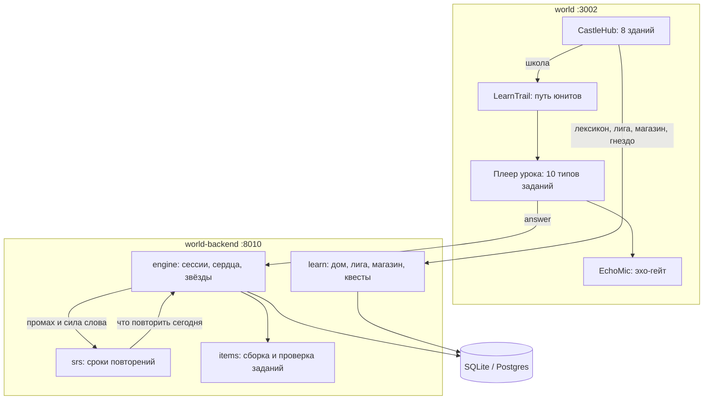

# Foxinburg World — главный промт разработки

Статус: v1 (2026-09-15). Единый источник правды для платформы `world/` + `world-backend/`.
Любой агент читает этот файл до первой правки кода. Если что-то в коде противоречит
этому документу — это дефект кода, а не документа.

Исторические документы (справка, не руководство): корневой `промт World .md` (первичный
продуктовый бриф на 5575 строк), [docs/world/architecture.md](../world/architecture.md),
[docs/world/world-art-bible.md](../world/world-art-bible.md) — арт-библ остаётся обязательным
для любого визуального ассета.

---

## 1. Продукт

**Кто.** Ребёнок 6–9 лет (1–2 класс), рядом родитель, который платит и хочет видеть результат.
Устройство — чаще телефон родителя (360–414 px), реже планшет и ноутбук.

**Обещание.** «Ребёнок говорит по-английски вслух с первого урока». Не узнаёт, не выбирает
правильный вариант мышкой — именно произносит. Это отличие от Duolingo-подобных тренажёров
и главная причина, по которой в продукте есть эхо-гейт.

**Обучающее ядро.** 18 юнитов, 108 уроков, 307 слов. Две книги:
- `starter-oral` — 6 юнитов устного английского 1 класса (family, school, room, pets, food, play);
- `prep-phonics` — 12 юнитов фонетики (satp → digraphs → review).

**Метрики успеха.**
- Доля уроков, где ребёнок произнёс все говорящие карточки (эхо-гейт пройден без обхода).
- Возврат на следующий день (стрик 2+).
- Слов в «Сокровищнице» с силой 4–5 через 30 дней.
- Ноль уроков, где картинка не соответствует слову.

**Чего в продукте нет и не будет без отдельного решения.** Кабинета родителя и учителя,
копирования BigBen, чатов между детьми, любых форм переписки. Развлекательный контур — это
замок, а не социальная сеть.

---

## 2. Границы архитектуры

```
world/           Next.js 16 + React 19 + Tailwind 4, порт 3002   (клиент)
world-backend/   FastAPI + SQLite,                 порт 8010     (сервер-авторитет)
```

- Вся игровая правда на сервере. Клиент не считает XP, монеты, сердца, звёзды и правильность
  ответа. Ответы приходят без ключей: `items.public_item()` вырезает `correct_index`,
  `correct_text` и пары до отправки.
- `world-backend` не импортирует ничего из `bot/`, `prototype/`, CRM. Это охраняется тестом
  [world-backend/tests/test_isolation.py](../../world-backend/tests/test_isolation.py) —
  не отключать.
- Идентификация игрока — заголовок `X-World-Player` (см. §9, дефект D-11: заголовок пока
  не подписан).
- База: `world-backend/data/world.sqlite`, путь переопределяется `WORLD_DB_PATH`.
  Миграции — идемпотентные `CREATE TABLE IF NOT EXISTS` / `ALTER TABLE` в
  [world-backend/app/world/db.py](../../world-backend/app/world/db.py).

Схема связей:



---

## 3. Definition of Done

Задача не считается сделанной, пока не выполнено всё:

1. `cd world-backend && pytest -q` — зелёный.
2. `cd world && npm test` — зелёный. Для правок в UI также `npm run lint` и `npm run build`.
3. Проверка в браузере вживую на 390 px и 1440 px. Ноль новых ошибок и предупреждений в консоли.
4. Логика, меняющая поведение сервера, закрыта тестом, написанным **до** реализации.
5. Запись сессии в [DEVLOG.md](../../DEVLOG.md) по правилам скила `session-journal`.
6. Ни одного нового хардкода числа экономики вне
   [world-backend/app/world/config.py](../../world-backend/app/world/config.py).
7. Ни одного нового хардкода цвета вне токенов
   [world/src/app/globals.css](../../world/src/app/globals.css).

---

## 4. Дизайн-система

**Токены** (`world/src/app/globals.css`):

| Токен | Hex | Роль |
|---|---|---|
| `--world-purple` | `#3a2953` | основа, панели, текст на светлом |
| `--world-purple-dark` | `#241a30` | фон приложения, глубина |
| `--world-yellow` | `#f5ed75` | главный акцент, награды, кнопка действия |
| `--world-teal` | `#7fd8c9` | вторичный акцент, знания, прогресс |
| `--world-ink` | `#ffffff` | текст и иконки на тёмном |

Запрещённые цвета: любой зелёный `#58cc02` и синий `#1cb0f6` (палитра Duolingo). На момент
v1 в `world/` их нет — так и держим.

**Шрифты.** Заголовки — Montserrat (`--font-display`), тексты — Nunito (`--font-sans`).
Новых семейств не добавлять.

**Правила интерфейса для ребёнка.**
- Минимальная зона нажатия 48×48 px, на карте замка — не меньше 44×44 px.
- Одна главная кнопка на экране, всегда жёлтая, всегда внизу, всегда в одном месте.
- Ни одного экрана без пути назад.
- Текст — по-русски, короткими фразами, обращение на «ты», без канцелярита.
  «Сначала повтори вслух» — да. «Необходимо выполнить произнесение» — нет.
- Числа наград анимируются к цели, а не появляются мгновенно.
- Эмодзи допустимы как глиф-заглушка для служебных слов (`NEVER_PICTURE`), но **не** как
  замена иллюстрации в новом арте.

---

## 5. Арт: правила и промт-шаблоны Meshy

Обязателен [world-art-bible.md](world-art-bible.md). Формула: premium cartoon × cinematic
× educational, палитра Фоксинбурга, читаемость важнее детализации.

**Маршрутизация генерации** (см. `.cursor/rules/foxinburg-media-routing.mdc`):
- Продакшн-стиллы и листы предметов — Meshy `meshy_text_to_image`, модель `nano-banana-pro`
  (9 кредитов). Фолбэк `nano-banana-2` (6) или `nano-banana` (3).
- 3D — Meshy MCP, сначала preview, refine только после одобрения.
- Генерация запускается **только** после подтверждения бюджета владельцем. Ключи не печатать.

**Шаблон промта для листа предметов (9 слов за одну генерацию).**

```
A 3x3 grid sheet of nine separate children's flashcard illustrations,
each item centered in its own cell, thick clean white gutters between cells,
pure white background, no text, no labels, no numbers, no shadows outside the cell.
Style: premium cartoon vector-like 3D, soft rounded shapes, warm cinematic light,
friendly and instantly readable for a 7 year old child, consistent style across all nine.
Cells left-to-right, top-to-bottom: 1) <word1>, 2) <word2>, ... 9) <word9>.
Each object photographed straight on, single object per cell, no scene, no background props.
Aspect ratio 1:1.
```

**Чек-лист приёмки любой картинки слова.**
1. Ребёнок называет предмет без подсказки текста — иначе брак.
2. Один объект, без сцены и лишних предметов.
3. Квадрат или близко к нему; короткая сторона не меньше 512 px.
4. Фон однотонный и светлый, объект не обрезан краем.
5. Стиль совпадает с соседними карточками юнита.
6. Никаких надписей, водяных знаков, логотипов, реальных брендов и лиц людей.

**Шаблон промта для интерьера здания замка.**

```
Isometric cutaway interior of <building>, top-down 3/4 view, cozy fairytale castle
architecture in deep purple #3a2953 with warm yellow #f5ed75 window light,
teal #7fd8c9 magical accents, premium cartoon 3D, cinematic soft light, rich readable
details, no text, no characters, square composition, 1:1.
```

---

## 6. Методика обучения

**Стадии урока** (порядок жёсткий, собирается в
[world-backend/app/world/items.py](../../world-backend/app/world/items.py) `build_lesson_items`):

1. `warmup` — первая карточка объяснения: зачем этот урок.
2. `theory` — остальные карточки объяснения (звук, фраза, ловушки).
3. `words` — `word_card` на каждое слово + до трёх `phrase_card`.
4. `listen` — 2–4 задания на слух.
5. `practice` — перемешанные тренировки: `mcq_en_ru`, `mcq_ru_en`, `type_en`, `match`,
   `tap_build`, `fill_blank`.
6. `wrap` — закрывающая карточка.

**Эхо-гейт — центральное правило.** Кнопка «Дальше» и проверка ответа заблокированы, пока
ребёнок не произнёс целевое слово или фразу. Гейт обязателен на всех говорящих карточках:
`word_card`, `phrase_card`, `listen`. Оценка — [world/src/lib/echo.ts](../../world/src/lib/echo.ts),
порог 70. Правила оценки: детские искажения прощаем, чужое короткое слово не принимаем
(`pen` не проходит за `pencil`). Если микрофон недоступен, ребёнок должен увидеть внятную
инструкцию, а не молчащий экран.

**Картинки.** Правило: карточка слова обязана читаться ребёнком **без текста**. Служебные
слова (`NEVER_PICTURE`) показываются глифом осознанно, а не «потому что фото не нашлось».

**Повторения (SRS).** Сила слова 0–5 в `word_stats`, срок следующего показа `due_at`.
Интервалы Лейтнера: 1, 3, 7, 14, 30 дней. «Двор тренировки» берёт то, что созрело сегодня,
плюс незакрытые промахи. Верный ответ гасит промах (`mistakes.cleared = 1`).

**Чекпойнты.** У юнита есть экзамен `{unit}-C1` после шести уроков: задания по всему юниту,
без новой теории. Логика уже есть в
[world-backend/app/world/engine.py](../../world-backend/app/world/engine.py) — включается
флагом `has_checkpoint`.

---

## 7. Игровой контур

Все числа — из [config.py](../../world-backend/app/world/config.py), в коде не дублировать.

- Сердца: максимум 5, регенерация +1 за 4 часа. Минус сердце только за тренировочные
  задания, никогда за карточки объяснения и слов.
- Урок: 40 XP + 10 за безошибочность, 15 монет + 5 за безошибочность.
- Практика: 10 XP и небольшая награда монетами с суточным лимитом.
- Звёзды: 3 за 100%, 2 за 90% и выше, 1 за остальное.
- Дневная цель: 50 XP. Стрик растёт раз в день, ломается при пропуске, «Заморозка серии»
  из магазина спасает один пропуск.
- Уровни: 10 порогов от 0 до 5000 XP с русскими титулами.
- Лига: недельный XP, тиры bronze / silver / gold, реальные место и размер лиги.
- Магазин: полные сердца (350), заморозка серии (200), стикер «Радуга» (80).
- Наклейки: по одной за юнит плюс особые (первый урок, без ошибок, серия дней).

---

## 8. Замок Фоксинбург

Карта — одна отрисованная картинка `/world/castle/map.png`, поверх неё восемь кликабельных
областей в процентах. Определения — [world/src/castle/buildings.ts](../../world/src/castle/buildings.ts),
рендер — [world/src/ui/CastleHub.tsx](../../world/src/ui/CastleHub.tsx).

| Здание | Назначение |
|---|---|
| Школа Foxy | вход в путь уроков |
| Лавка Фокси | магазин за монеты |
| Башня Славы | лига и рейтинг недели |
| Сокровищница слов | все изученные слова и их сила |
| Башня стикеров | альбом наклеек |
| Двор тренировки | повторение без нового урока |
| Гнездо Foxy | уровень, сердца, серия |
| Беседка поручений | задания на сегодня |

Правила: у каждого здания есть отрисованный интерьер 1024×1024; закрытое здание получает
осмысленное состояние «закрыто» (силуэт, туман, замок), а не серый прямоугольник; замок —
развлекательное дополнение к учёбе, поэтому любая его механика ведёт обратно к словам.

---

## 9. Реестр дефектов v1

Статус на 2026-09-16: **D-01…D-17 закрыты или сняты** в сессии 97
(см. DEVLOG). Ниже — исходный список для истории.

**Логика и методика**
- D-01 ~~Промахи никогда не гасятся~~ → `engine._clear_mistake` / `_remember_mistake`
- D-02 ~~Лига фиктивная~~ → реальный `rank`/`size`/`top` в `learn.league`
- D-03 ~~Нет SRS~~ → `srs.py` + `due_at`
- D-04 ~~Чекпойнты выключены~~ → `has_checkpoint: True`, экзамен 12 заданий
- D-05 ~~Эхо-гейт не на listen~~ → `needsEchoFor` включает `listen`
- D-06 ~~Практика 0 монет~~ → `PRACTICE_COINS_DAILY_CAP`

**Контент и картинки**
- D-07 ~~133 Twemoji-дыры~~ → фирменные листы Meshy + алиасы
- D-08 ~~17 вики-превью 330px~~ → заменены
- D-09 ~~50 мёртвых JPG~~ → удалены
- D-10 ~~Нет лицензий~~ → `ATTRIBUTION.md` + своя генерация

**Техника и продакшн**
- D-11 ~~Голый X-World-Player~~ → HMAC при `WORLD_PLAYER_SECRET`
- D-12 ~~TTS только macOS~~ → `espeak-ng` + `pregen_tts.py`
- D-13 ~~Postgres stub~~ → слой в `db.py` (см. DEPLOY.md)
- D-14 ~~CI только backend~~ → frontend job в `world-ci.yml`
- D-15 ~~Мёртвый 3D-код~~ → удалён
- D-16 ~~map-v2 неиспользуем~~ → удалён; вечер — `map-dusk` + фильтр
- D-17 ~~Нет e2e~~ → `world/e2e/lesson.spec.ts`

---

## 10. Правила работы агента

- План до кода. Для нетривиального — режим плана, затем исполнение по плану.
- TDD для серверной логики: падающий тест, минимальная реализация, зелёный тест.
- Отладка через поиск причины, а не заклейку симптома.
- Один смысловой блок работы — один коммит с русским сообщением в стиле репозитория
  (`feat(world): ...`, `fix(world): ...`).
- Медиа: одна генерация, дешёвые настройки по умолчанию, подтверждение перед лишними
  картинками, refine и видео. Ключи никогда не печатать.
- Не расширять зону изменений без нужды: не переписывать работающее ради стиля.
- Не удалять тесты, чтобы «стало зелёным».
- Итог сессии — запись в `DEVLOG.md` и актуальный раздел «Где остановились».

---

## 11. Команды

```bash
# бэкенд
cd world-backend && pip install -r requirements.txt && pytest -q
cd world-backend && uvicorn main:app --reload --port 8010

# фронтенд
cd world && npm install && npm run dev     # http://127.0.0.1:3002
cd world && npm test && npm run lint && npm run build
```
